# 👋 Hey there, I'm Yassine Assamdi!

<div align="center">
  
</div>

<p align="center">
  
  
  
</p>

---

## 🎯 About Me

```typescript
const yassine = {
  name: "Yassine Assamdi",
  location: "Morocco 🇲🇦",
  role: "Full Stack Developer",
  experience: "3+ years",
  passion: ["Clean Code", "User Experience", "Problem Solving"],
  currentlyLearning: ["AI/ML Integration", "Cloud Architecture", "Web3"],
  funFact: "I debug with console.log and I'm not ashamed! 🐛"
};
```

## 🛠️ Tech Arsenal

<div align="center">

### 🎨 Frontend


### ⚙️ Backend


### 🗄️ Database & Cloud


</div>

### 🌟 Project Highlights

| Project | Description | Tech Stack | Links |
|---------|-------------|------------|-------|
| **🚀 E-Commerce Platform** | Full-stack e-commerce solution with real-time inventory | React, Node.js, MongoDB, Stripe | [Demo](https://demo-link.com) • [Code](https://github.com/yassineassamdi/ecommerce) |
| **📱 Task Management App** | Collaborative task manager with real-time updates | Vue.js, Express, PostgreSQL, Socket.io | [Demo](https://demo-link.com) • [Code](https://github.com/yassineassamdi/task-manager) |
| **🤖 AI Chat Assistant** | Intelligent chatbot with natural language processing | Python, FastAPI, OpenAI API, React | [Demo](https://demo-link.com) • [Code](https://github.com/yassineassamdi/ai-chat) |

## 🎯 What I'm Up To in 2025

```mermaid
graph LR
    A[🎯 Current Goals] --> B[AI Integration]
    A --> C[Cloud Architecture]
    A --> D[Web3 Development]
    A --> E[Open Source Contributing]
    
    B --> F[Building AI-powered apps]
    C --> G[AWS Solutions Architecture]
    D --> H[Smart Contracts & DApps]
    E --> I[Contributing to React ecosystem]
```

<div align="center">



</div>

- 🤖 **AI Integration**: Building intelligent applications with OpenAI and local LLMs
- ☁️ **Cloud Architecture**: Mastering AWS services and serverless computing
- 🌐 **Web3 Development**: Exploring blockchain and decentralized applications
- 🔧 **DevOps Excellence**: Implementing CI/CD pipelines and infrastructure as code
- 📚 **Knowledge Sharing**: Writing tech blogs and creating educational content

## 💼 Professional Experience

```yaml
Current Role: Senior Full Stack Developer
Experience: 3+ years in web development
Specialties:
  - Full-stack web applications
  - API design and integration
  - Database optimization
  - Cloud deployment
  - Team collaboration

Notable Achievements:
  - Led development of 5+ production applications
  - Improved application performance by 40%
  - Mentored junior developers
  - Contributed to open-source projects
```

## 🤝 Let's Connect!

<div align="center">
  
[](https://www.linkedin.com/in/assamdi-yassine/)
[](mailto:assamdiyassine1@gmail.com)
[](https://your-portfolio-link.com)
[](https://twitter.com/yourusername)

</div>
 

## 🎵 Currently Vibing To

<div align="center">
  
</div>

---

<div align="center">
  
</div>

<div align="center">
  <sub>⭐ From <a href="https://github.com/yassineassamdi">Yassine Assamdi</a> with ❤️</sub>
</div>
